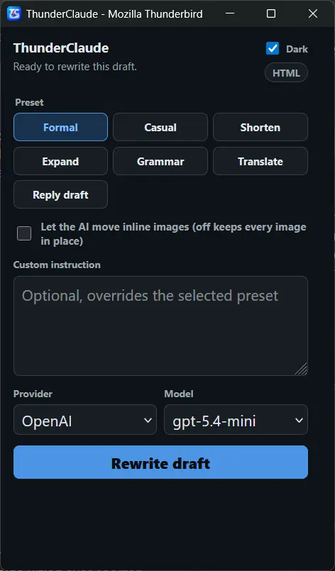
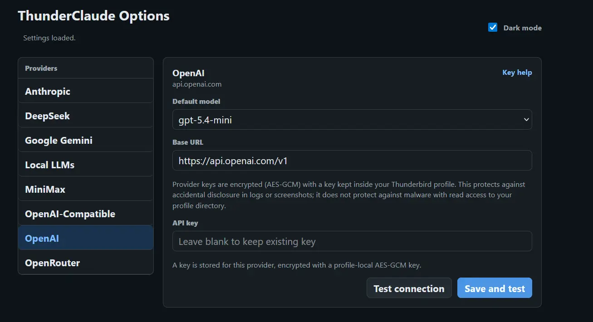

<p align="center">
  
</p>

# ThunderClaude

ThunderClaude is a Thunderbird MailExtension for rewriting the current
compose-window email with LLM presets or a custom instruction. It rewrites only
the text you select, or the whole draft after a confirmation step, and leaves
every inline image untouched by default.

## Current Status

The latest release is `v0.2.0`, available from the
[GitHub Releases](https://github.com/kenzo47/ThunderClaude/releases) page.
Listing on [addons.thunderbird.net](https://addons.thunderbird.net) is in
progress; until it is approved, install the packaged XPI as described below.

## Features

- **Presets and custom instructions**: make formal or casual, shorten, expand,
  fix grammar, translate, or draft a reply, plus your own free-text instruction.
- **Selection-aware scope**: by default ThunderClaude rewrites only the text you
  have selected, so quoted replies and forwarded threads keep their original
  styling. With nothing selected it asks for confirmation before rewriting the
  whole draft.
- **Inline images preserved by default**: every inline image (`cid:` attachment,
  remote, or `data:` image) stays exactly in place. An optional toggle lets the
  model move images when you want it to, and it can never silently drop one.
- **Bring your own provider**: Anthropic, OpenAI, Gemini, xAI Grok, Z.ai GLM,
  MiniMax, DeepSeek, OpenRouter, any OpenAI-compatible endpoint, or local models
  via Ollama or LM Studio.
- **Local-first key storage**: your API key is stored encrypted at rest and is
  sent only to the provider you configured. No telemetry.

## Screenshots

<p align="center">
  
</p>

The compose-window popup. Choose a preset (Formal, Casual, Shorten, Expand,
Grammar, Translate, or Reply draft) or type a custom instruction that overrides
it. Inline images stay exactly where they are unless you tick "Let the AI move
inline images", and your provider and model are one click away. The header shows
whether the draft is HTML or plain text and lets you flip between light and dark.

<p align="center">
  
</p>

The options page. Pick any supported provider from the sidebar, set its default
model and base URL, and save an API key that is encrypted at rest (AES-GCM) with
a key kept inside your Thunderbird profile. "Test connection" checks the key
before you depend on it, and a blank key field leaves an existing key in place.

## Requirements

- Thunderbird 128 or newer.
- At least one LLM provider:
  - an API key for Anthropic, OpenAI, Gemini, xAI Grok, Z.ai GLM, MiniMax,
    DeepSeek, OpenRouter, or any OpenAI-compatible endpoint, or
  - a local model served by Ollama or LM Studio (no key required).
- Node.js 22 or newer, only if you build from source.

## Development

Install dependencies:

```bash
pnpm install
```

Load the extension in a temporary Thunderbird profile:

```bash
pnpm dev
```

By default this launches `thunderbird`. Set `THUNDERBIRD_BINARY` when the binary
has a different name or path:

```bash
THUNDERBIRD_BINARY=/path/to/thunderbird pnpm dev
```

Run the required gates before committing:

```bash
pnpm test
pnpm lint
```

Prepare the unpacked extension files:

```bash
pnpm build
```

This writes `dist/unpacked/` for inspection and `dist/thunderclaude-0.3.1.xpi`
for local installation testing.

## Install

### Development Install

Use `pnpm dev` for active development. It starts `web-ext` with Thunderbird
and loads the repository as a temporary extension.

On first run:

1. Open a Thunderbird compose window.
2. Click the ThunderClaude compose-action button.
3. Complete onboarding by choosing a provider, testing it, and saving the
   default model.
4. Reopen the compose-action popup and choose a rewrite preset.

### Packaged Install

Build the XPI:

```bash
pnpm build
```

Then install it:

1. Open Thunderbird Add-ons Manager.
2. Use the gear menu to choose "Install Add-on From File".
3. Select `dist/thunderclaude-0.3.1.xpi`.

Thunderbird's official add-on install guide documents the Add-ons Manager file
install flow:
https://support.mozilla.org/kb/installing-addon-thunderbird

## Privacy

ThunderClaude has no servers and collects no analytics or telemetry. Your draft
and instruction are sent only to the LLM provider you configure, only when you
trigger a rewrite; your API key is stored locally and encrypted at rest. See
[`PRIVACY.md`](PRIVACY.md) for the full policy.

## Contributing

Contributions are welcome. Please open an issue or pull request, keep changes
focused, and run `pnpm test` and `pnpm lint` before every commit.

Thanks to [@robertobuti](https://github.com/robertobuti) for diagnosing the Anthropic
CORS failure and contributing the remembered custom instruction (v0.3.1).

## License

Copyright (C) 2026 Kenzo Wijnants

ThunderClaude is free software: you can redistribute it and/or modify it under
the terms of the **GNU General Public License v3.0** as published by the Free
Software Foundation. See [`LICENSE`](LICENSE) for the full text.

This means you are free to use, study, fork, and modify ThunderClaude. If you
distribute a modified version, you must release your changes under the same
GPL-3.0 license with source, so nobody can take this code, close it up, and
resell it as a proprietary product.

ThunderClaude is distributed in the hope that it will be useful, but WITHOUT ANY
WARRANTY; without even the implied warranty of MERCHANTABILITY or FITNESS FOR A
PARTICULAR PURPOSE. See the GNU General Public License for more details.
